<p align="center">
  <a href="" rel="noopener">
 </a>
</p>

<h3 align="center">
Automation-Selenium-SauceDemo</h3>

<div align="center">

[]()
[](https://github.com/yushirm/Automation-Selenium-SauceDemo/issues)
[](https://github.com/yushirm/Automation-Selenium-SauceDemo/pulls)

</div>

---

A test automation project using the Selenium Automation Framework that targets Sauce Labs [Swag Labs](https://www.saucedemo.com/) site.

## 📝 Table of Contents

- [About](#about)
    - [Test Design Approach](#test-design-approach-a-name--testdesigna)
- [Getting Started](#getting_started)
- [Usage](#usage)
- [Tools Used](#built_using)
- [TODO](./TODO.md)
- [Authors](#authors)

## 🧐 About <a name = "about"></a>

The purpose of this project is to show how I would create and manage a Selenium Test Automation Framework. The project consists of functional tests for the SauceDemo website, specifically, using automation to simulate expected user behaviour (e.g. Login, Add to Cart, Checkout, etc). It's been written using C# and based on the .NET 6.0 framework. NUint and Fluent Assertions were used to manage test execution and assertion.

### Test Design Approach <a name = "test_design"></a>
Test were created using the [Page Object Model](https://www.browserstack.com/guide/page-object-model-in-selenium#:~:text=Page%20Object%20Model%2C%20also%20known,application%20as%20a%20class%20file.) in Selenium. It is a design pattern used in test automation that creates and Object Repository for the web UI elements of the different pages of a website. An outline of how this was implemented is shown below:

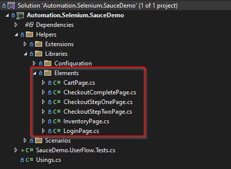

Tests are seperated into various classes depending on the page object to be tested. Isolation of tests helps for easier code management and makes it easier to determine Page Object Passed/Failed when running the tests.

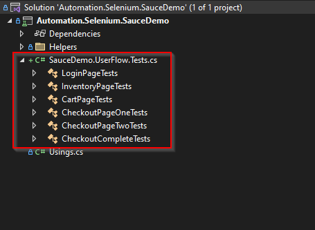

The tests were written in the style of <b>Given_When_Then</b>, which is a TDD/BDD approach that helps link test cases with end user interaction and behaviour. It makes the expected outcome more readable leading to test results being easier to interpret by non-technical stakeholders.

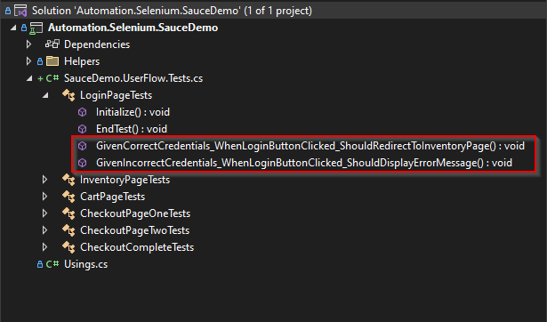

The UserFlow test suite (SauceDemo.UserFlow.Tests.cs) contains and End-to-End user journey for the site, i.e. From <b>Logging In</b> to <b>Completing a Purchase</b>. The tests assert that the correct elements are present after the user performs an action (e.g. correct Page Header is present).

There are more scenarios that need to be covered in future so this solution is still a work in progress. Planned future work includes adding tests for the following:
- Asserting additional page elements and correct element functionality
- Tests for different user types
- Negative test cases

The scope of this work in outlined in [TODO.md](./TODO.md).

## 🏁 Getting Started <a name = "getting_started"></a>
This section outlines what you will need to run the tests locally.

### Prerequisites
This test solution was built and run on the following:
- Windows OS 
- Chrome Browser

This test solution was initially built with the following dependencies:
- Microsoft Visual Studio 2022 (Version 17.3.5)
- Microsoft.NET.Test.Sdk (Version 17.3.2)
- FluentAssertions (Version 6.7.0)
- NUnit (Version 3.13.3)
- NUnit3TestAdapter (Version 4.2.1)
- NUnit.Analyzers (Version 3.3.0)
- coverlet.collector (Version 3.1.2)
- Selenium.Support (Version 4.5.0)
- Selenium.WebDriver (Version 4.5.0)
- Selenium.WebDriver.ChromeDriver (Version 105.0.5195.5200)

*Note 1: Version 105.0.5195.5200 of the Selenium.WebDriver.ChromeDriver was chosen to ensure compatibility, as using the latest versio might create a mismatch with the version of Google Chrome installed on the system.*

*Note 2: The Selenium.WebDriver.ChromeDriver has multi-OS support and selects the correct version based on your OS during build. Configuration can be found [here](https://www.nuget.org/packages/Selenium.WebDriver.ChromeDriver/).*

### Installing
<u>Cloning the repository</u>

Create clone of the repository on your local machine via command-line or other management tool.

```
$ git clone https://github.com/yushirm/Automation-Selenium-SauceDemo/
```


<u>Installing Visual Studio Professional 2022</u>

You can download Visual Studio Professional 2022 from [Here](https://visualstudio.microsoft.com/vs/).
- Run the installer
- At the Work Loads screen make sure to select the following:
    - ASP.NET and Web Development
    - .NET Desktop development

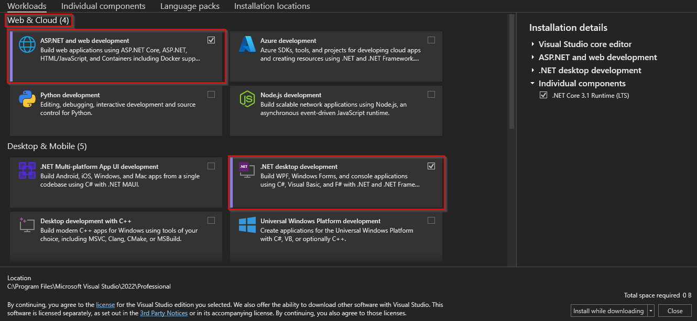

- Confirm that .NET 6.0 is installed by checking the Individual Components tab

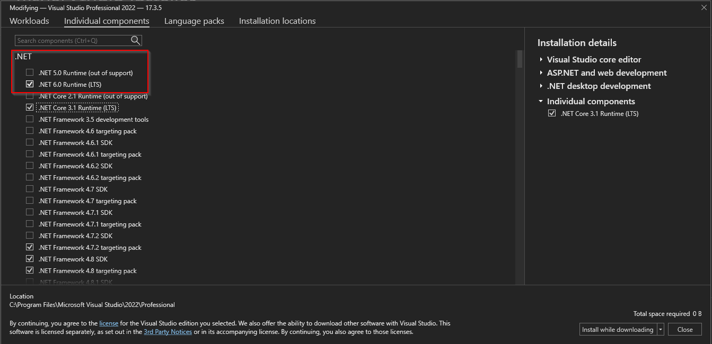

- Complete the installation


<u>Package Management</u>

The other dependencies can be managed via the Nuget package manager in Visual Studio. This will only be available when the solution is loaded. These do not need to be installed by default as they are included in the solutionl.

- You can confirm they are installed by navigating to the Nuget Package Manager on Visual Studio

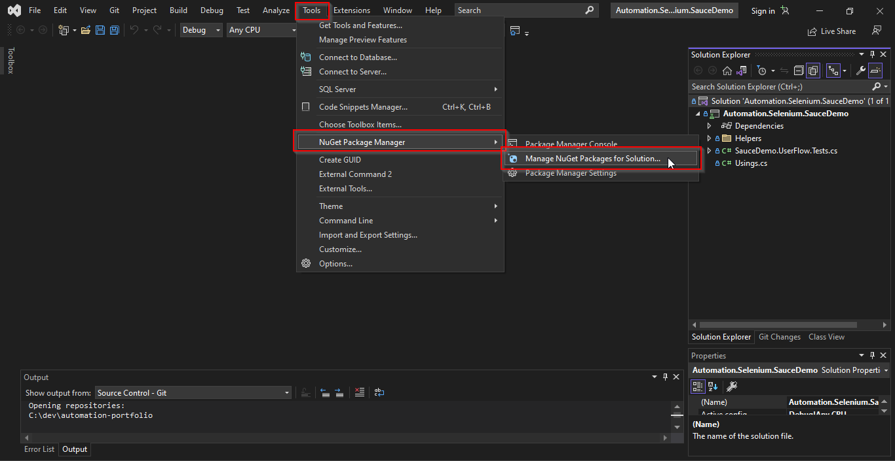

- Click on the Installed tab to see packages and manage versions. You can also change versions here.

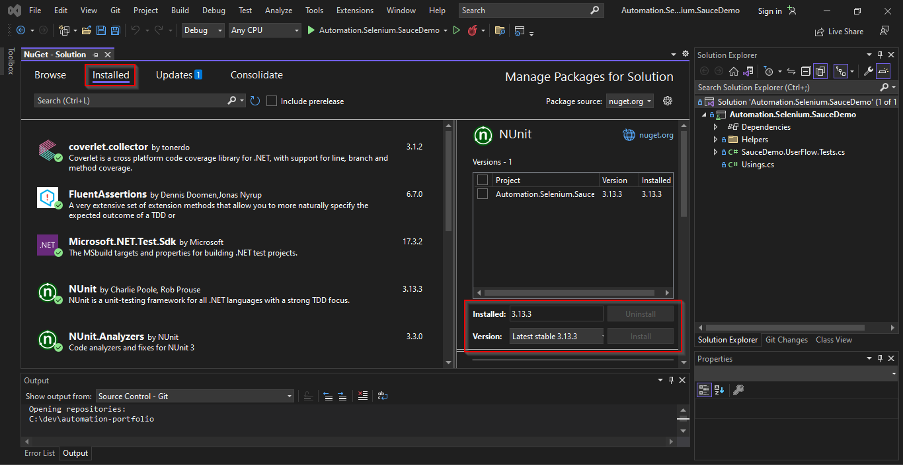


## 🔧 Running the tests <a name = "tests"></a>
### Visual Studio Test Runner
Follow the steps below to run the tests in Visual Studio Professional 2022.

- Select <b>File > Open > Project/Solution</b> in Visual Studio

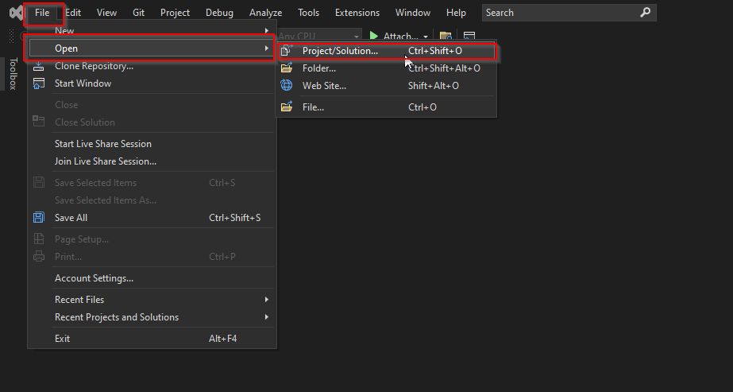

- Navigate to your checked out repository and open <b>Automation.Selenium.SauceDemo.sln</b>
- Select <b>Test > Run All Tests</b> to start all tests (or can start them in Test Explorer: <b>Test > Test Explorer</b>)

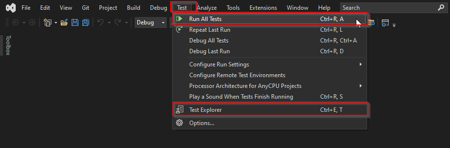

- Build and Test will begin in the Test Explorer window. Drop down to view the outcomes for each test.

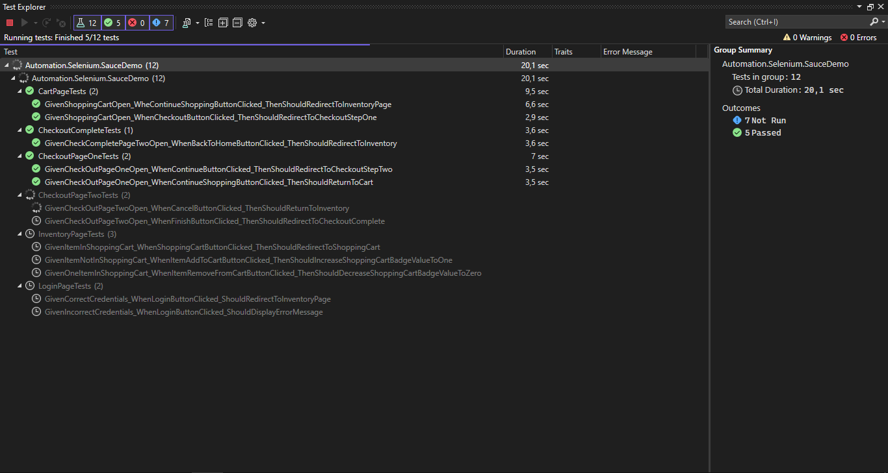

### Command-Line using Dotnet
You can also execute the test using the command-line via dotnet

- Navigate to <b>.\bin\Debug\net6.0\</b> via the command-line.
- Execute the following command:

```
dotnet test --verbosity detailed Automation.Selenium.SauceDemo.dll
```
The test run will display as follows in the command window:

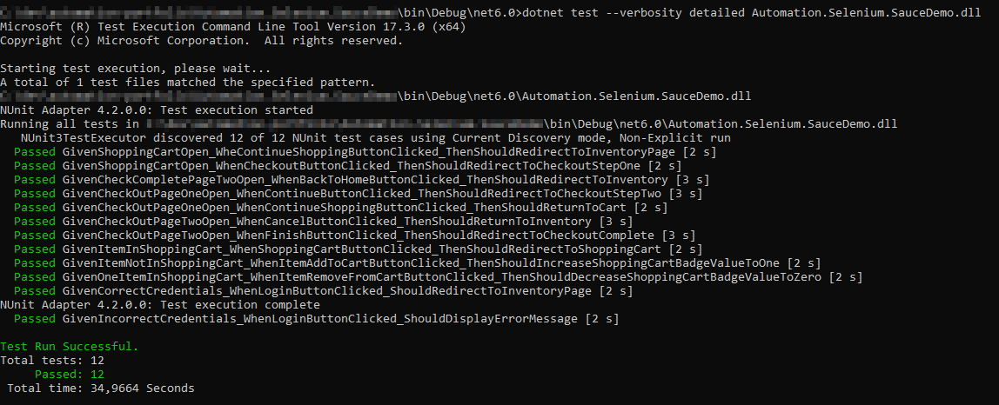

### Disable Chrome Headless Mode
The tests are desiged to run in Chrome Headless by default. You can disable setting to view test execution in the Browser.

- Open the file <b>".\Helpers\Libraries\Configuration\TestConfiguration.cs"</b>
- Change the attribute <b>SupportedBrowser</b> to "GoogleChrome" as shown:

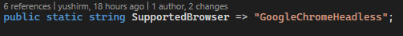 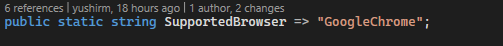

The tests wil now run with Chrome UI enabled

## ⛏️ Tools Used <a name = "built_using"></a>
- [Visual Studio Professional](https://visualstudio.microsoft.com/vs/) - 2022 V17.3.5
- [.NET 6.0 Framework](https://dotnet.microsoft.com/en-us/download/dotnet/6.0)
- Testing Frameworks
    - [Selenium](https://www.selenium.dev/)
    - [NUnit](https://nunit.org/)
    - [Fluent Assertions](https://fluentassertions.com/)

## ✍️ Authors <a name = "authors"></a>
- [yushirm](https://www.linkedin.com/in/yushir-rugnath-maharaj-44b86222/) - Initial design and coding